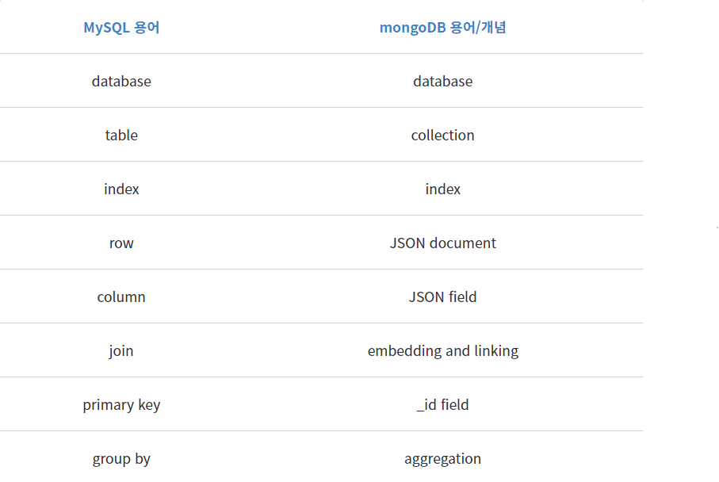

# Mongo DB 사용법

## 1. Mongo DB 개요

**NoSQL 데이터베이스.**  
단순한 키와 값의 쌍으로 이루어지며 인덱
스와 데이터는 분리되어 별도로 운영된다.

> 특징

- Join이 없으므로 Join이 필요 없도록 데이터 구조화가 필요
- 다양한 종류의 쿼리문을 지원(필터링, 수집, 정렬, 정규표현식 등)
- 관리의 편의성
- 스키마 없는(Schemaless) 데이터베이스를 이용한 신속 개발. 필드를 추가하거나 제거하는 것이 매우 쉬워짐
- 쉬운 수평 확장성
- 인덱싱 제공

---

## 2. Mongoose

### 1. **Mongo DB - mongoose**

MongoDB를 nodejs에서 사용하기 위한 라이브러리.

```js
mongoose.connect(
  "mongodb+srv://[Atlas 주소 붙여넣고 패스워드 수정, 클러스터 이름 수정]",
  { useNewUrlParser: true }
); // db에 연결

var db = mongoose.connection; // db 객체 받아오기

db.on("error", console.error.bind(console, "connection error:")); // error 처리

db.once("open", () => {
  console.log("DB connected");
}); // db 열기
```

### 2. **Mongoose Achitectrue**

> **MongoDB 용어 및 개념**  
> 

- **모델**  
  mongoDB에서 데이터를 저장하는 기본 단위인 도큐먼트의 형태를 의미.  
  mongoose에서 제공하는 Schema 인터페이스를 통해 생성 가능.

```js
var Schema = mongoose.Schema,
  ObjectId = Schema.ObjectId;
var ArticleSchema = new Schema({
  author: ObjectId,
  title: String,
  body: String,
  date: Date,
}); // 스키마 정의

var ArticleModel = mongoose.model("Article", ArticleScheme); //모델 생성
```

- **모델 사용**  
  생성한 모델의 인스턴스를 또 한번 생성.

```js
var instance = new ArticleModel();
instance.title = "hello";
instance.save(function (err) {
  // save 실행 후 콜백 함수의 내용
});
instance.find({}, function (err, docs) {
  // find 실행 후 콜백 함수의 내용
});
```

### 3. **MongoDB methods**

- **검색하기**  
  각각 검색 질의문, 출력하고자 하는 필드, 옵션, 그리고 콜백 함수  
  _docs_ 는 검색된 모든 도큐먼트를 담고있는 배열.

```js
Model.find(query, fields, options, callback);
//fields 값을 각각 변수에 0으로 설정하면 보이지 않고, 1로 설정하면 보인다.

Model.find({ "some.value": 5 }, function (err, docs) {
  // 콜백 함수의 내용
});

// 오직 하나의 도큐먼트만 전달됨.
Model.findOne({ age: 5 }, function (err, doc) {
  // 콜백 함수의 내용
});

//_id 값을 이용하여 검색, 하나만 넘어옴
Model.findById(obj._id, function (err, doc) {
  // 콜백 함수의 내용
});
```

- **도큐먼트 추가**  
  save 메소드 이용

```js
//모델을 이용하여 바로 추가하는 방법
ArticleModel.create(
  { title: "Title", body: "Contents", date: new Date() },
  function (err) {
    if (err) {
      return handleError(err);
    }
    // save() 성공 후 수행할 내용
  }
);
```

- **도큐먼트 삭제**

```js
//특정 조건에 맞는 도큐먼트 삭제
ArticleModel.remove({ title: "Title" }, function (err) {
  if (err) {
    return handleError(err);
  }
  // remove() 성공후 수행할 내용
});
```

_mongoDB 3.2 버전부터는 remove메소드에서 좀 더 세분화된 deleteOne, deleteMany가 추가되면서 remove 대신 이 두 메소드를 사용하는 것을 권장_

```js
memoModel.deleteOne({ _id: _id }, function (err, result) {
  if (err) {
    throw err;
  } else {
    res.json({ status: "SUCCESS" });
  }
});
```
